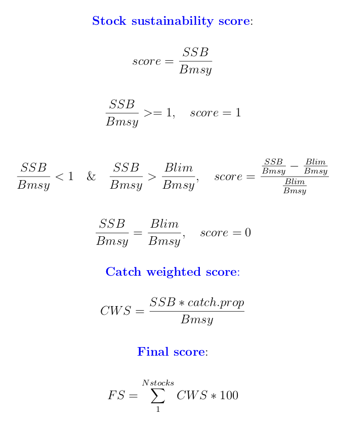
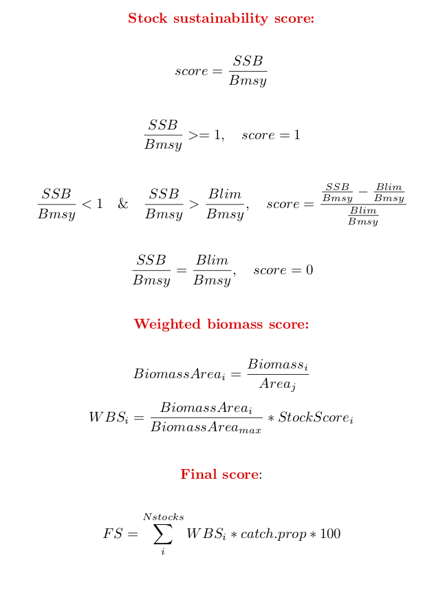

###  This folder is for the output data - tables with calculations of scores and intermediate results

For example, the data tables with ready-made indices of sustainable fisheries, which we will upload on the Coastal barometer website, will be storted here.

**Data tables in the folder**:

filename.csv  | Explanation
------------- | -------------
catch_weighted_score | proportions of catch per municipality and catch weighted score
fishery_final_score| final score of  fisheries sustainability per municipality (all stocks).
fish_catch_by_municipality|cleaned and formatted catch (landings) data per municipality
ices_stock_stats | ICES data on SSB, Bmsy,Blim for 1994 - 2017
sustain_score | estimated fisheries sustainability score per municipality
fishery_final_score_smoothed_by_area.csv | final fisheries score based on smoothed (3-year rolling mean) and scaled by sea area    catches (as in **Approach2**)

**Explanation of calculations**:

### Approach 1

### Approach 2

                                   

